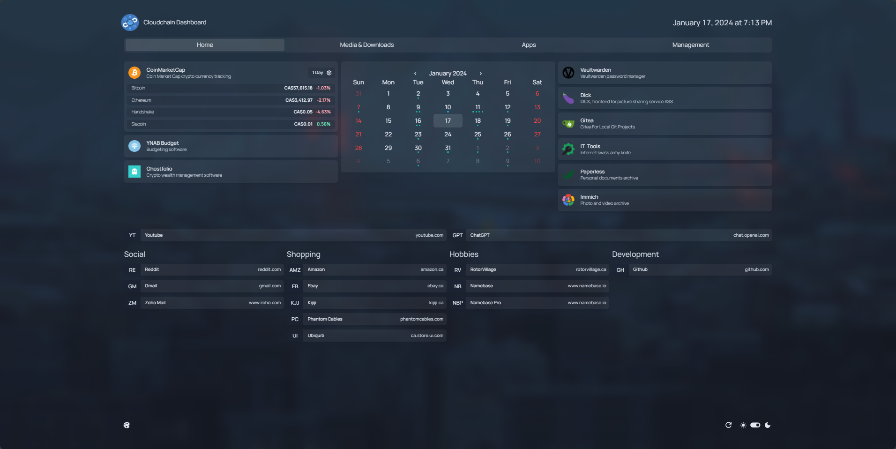

<!------------------------- PROJECT Logger ------------------------->
 

  

<h2 align="center"><b>Facinorous' Homepage Example</b></h2>

An example structure of how to configure a Homepage. <a href="./pictures"> Example Pictures </a>
 

 

<!------------------------- GETTING STARTED ------------------------->

<h2 align="center"><b>Prerequisites</b></h2>
Satania uses MongoDB as the database backend and will need to be setup before the bot can be run.
  

1. `Docker Compose` - [Please Read](https://gethomepage.dev/latest/installation/docker/)

<h2 align="center"><b>Setup</b></h2>

1. Clone this repo

2. Navigate into project folder

3. Rename `.env.example` into `.env` and change all variables needed

4. Change variables in `/config` to match your set up

5. Run `docker compose up -d` to start project

**NOTE**: if you change images, or the `.env` file after the container has already been started, you need to fully recreate the container to show the new changes.